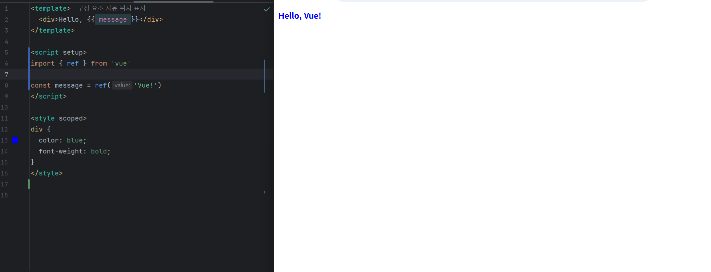
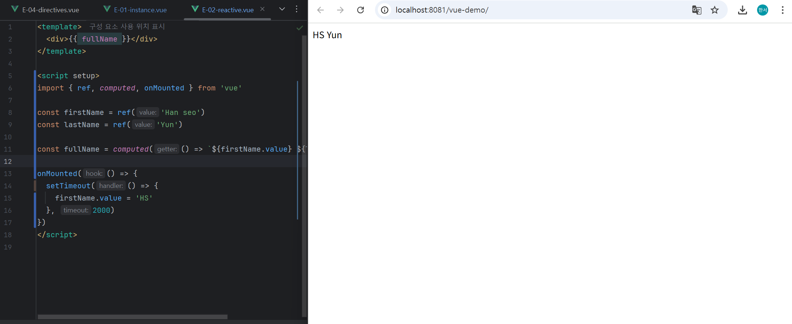
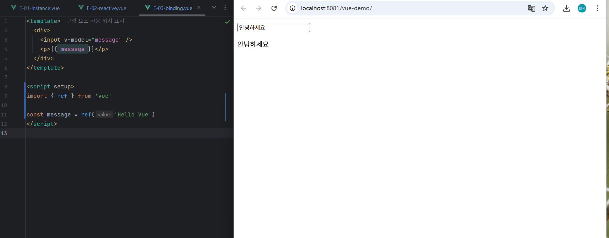
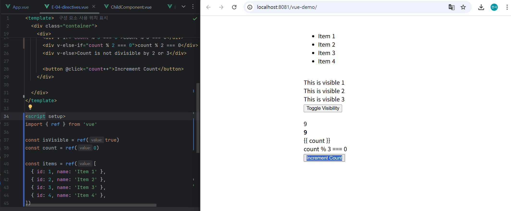
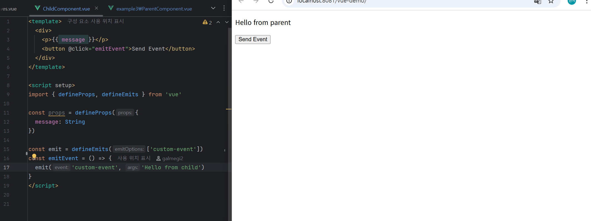
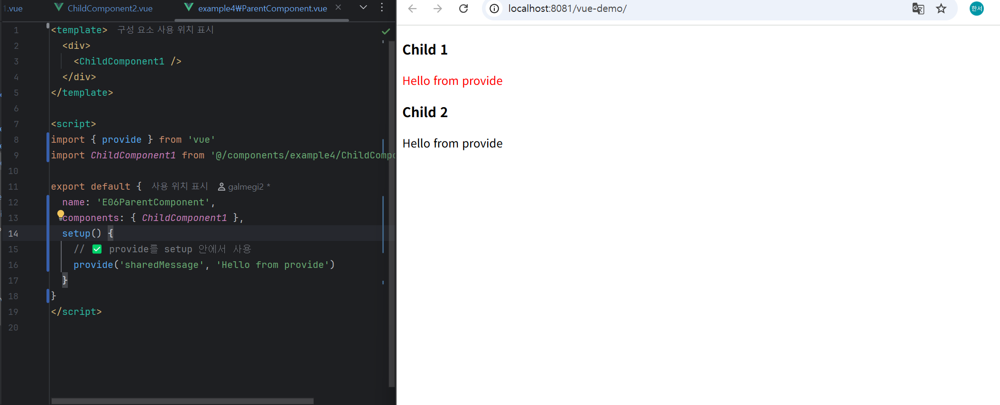
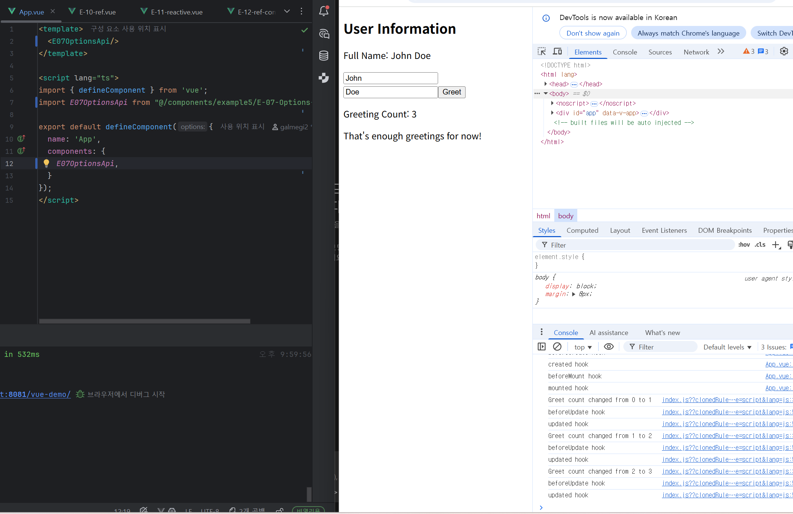
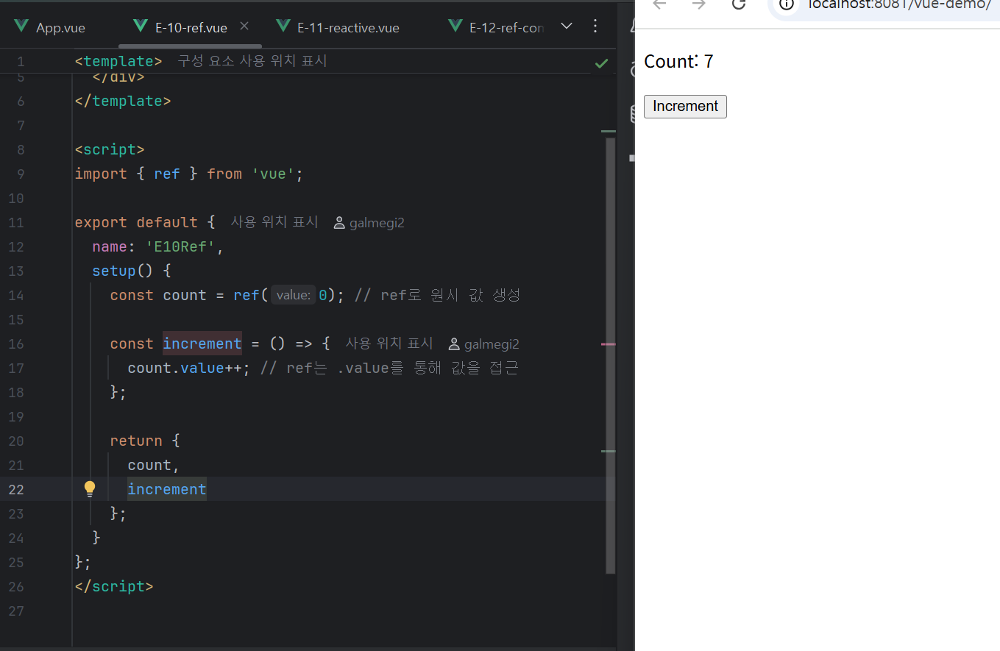
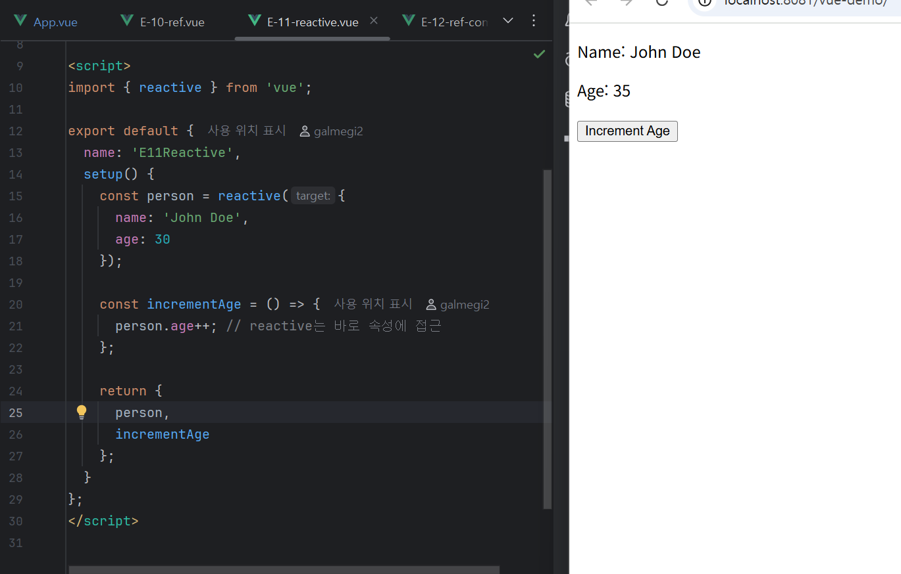
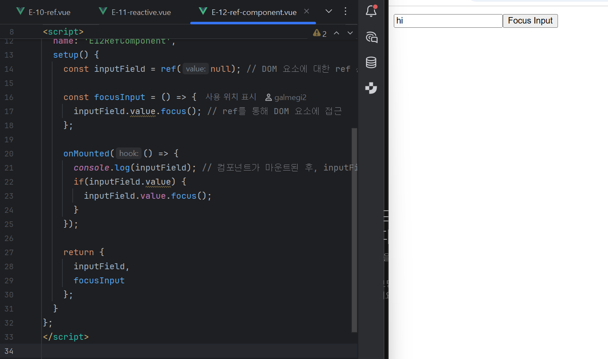

Vue2 기반 코드를 Vue3 스타일로 전환

1. E01 
   Composition API(scrpit setup)방식으로 리팩터링, ref()를 사용한 반응형변수 message 선언
   

3. E02 
   Composition API(script setup)로 리팩터링, ref로 반응형 변수 (firstName,lastName)선언, computed로 fullName을 계산
   

5. E03 
   Composition API(script setup)로 리팩터링, ref를 사용해 message 선언
   

7. E04 
   Composition API(script setup)로 리팩터링, ref를 사용해 isVisible,items,count 선언
   

9. E05 
   Composition API(script setup)으로 리팩터링, 부모 컴포넌트는 ref를 이용해 parentMessage를 관리, 자식 컴포넌트로 props로 메시지 전달하여, 자식에서 발생한 이벤트를 수신 
   

6.E06 
   Composition API(setup) 기반으로 리팩터링, 부모 컴포넌트에서 provide로 데이터를 하위 컴포넌트에 전달, 자식 컴포넌트에서는 inject를 통해 해당 데이터를 참조하도록 변경
   

7. E07 
   E07 -> E08 
   Options API코드를 Composition API(일반 setup)으로 리팩터링한 버전

   E08 -> E09  
   (script setup)문법으로 단순화한 최신 Composition API 버전 
   
8. E10 ~ 12 (이미 vue3문법) 
   E10 -> ref,setup을 이용한 Composition API  

   E11 -> reactive,setup을 이용한 Composition API  

   E12 -> ref,onMounted,setup을 이용한 Composition API + Lifecycle Hook 
   
   
   